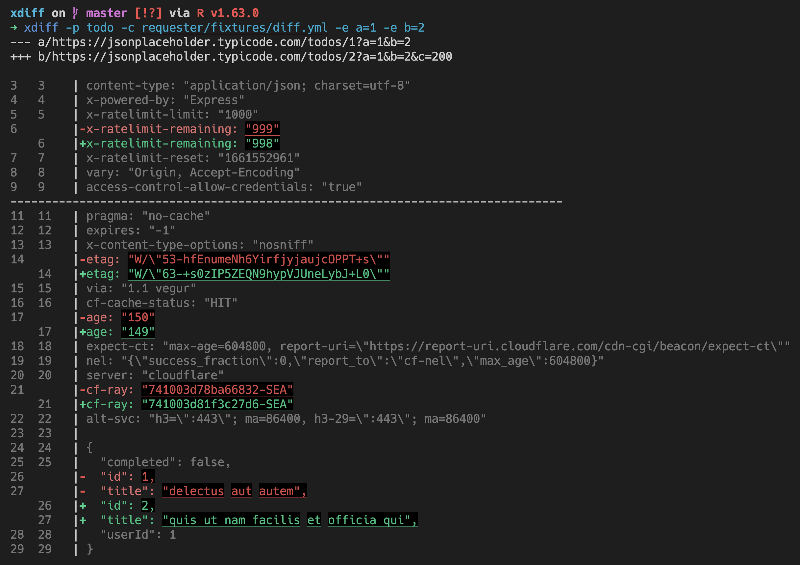
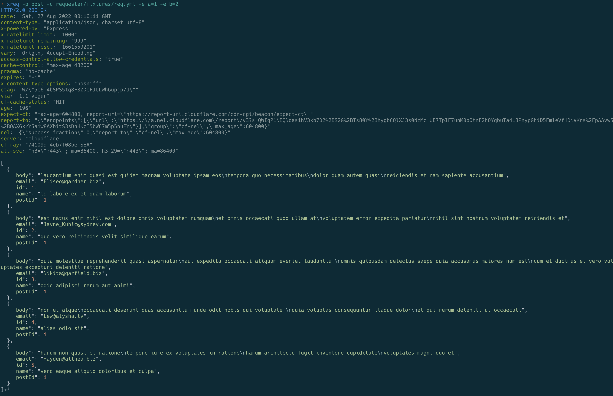
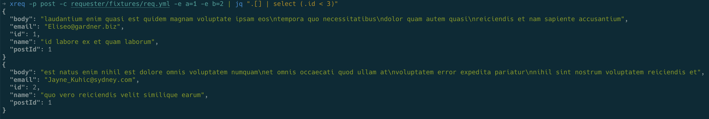

# HTTP request and diff tools

There're two separate CLIs provided:

- xdiff: A diff tool for comparing HTTP requests. It could be used to compare the difference between production staging or two versions of the same API.
- xreq: A tool to build HTTP requests based on predefined profiles. It could be used to replace curl/httpie for building complicated HTTP requests.

## xdiff

### Configuration

You can configure multiple profiles for xdiff. Each profile is identified by a name. Inside a profile you can define the details of the two requests (method, url, query params, request headers, request body), and also what part of the response should be skipped for comparison (currently only headers could be skipped).

```yaml
---
rust:
  request1:
    method: GET
    url: https://www.rust-lang.org/
    headers:
        user-agent: Aloha
    params:
      hello: world
  request2:
    method: GET
    url: https://www.rust-lang.org/
    params: {}
  response:
    skip_headers:
      - set-cookie
      - date
      - via
      - x-amz-cf-id
```

You could put the configuration in `~/.config/xdiff.yml`, or `/etc/xdiff.yml`, or `~/xdiff.yml`. The xdiff CLI will look for configuration from these paths.

### How to use xdiff?

You can use `cargo install xdiff` to install it (need help to [install rust toolchain](https://rustup.rs/)?). Once finished you shall be able to use it.

```bash
➜ xdiff --help
xdiff 0.4.1
A CLI to diff two requests based on predefined profiles.

USAGE:
    xdiff <SUBCOMMAND>

OPTIONS:
    -h, --help       Print help information
    -V, --version    Print version information

SUBCOMMANDS:
    help     Print this message or the help of the given subcommand(s)
    parse    parse a URL and print the generated diff config
    run      diff two API responses based on a given profile

➜ xdiff run --help
xdiff-run
diff two API responses based on a given profile

USAGE:
    xdiff run [OPTIONS] --profile <PROFILE>

OPTIONS:
    -c, --config <CONFIG>      Path to the config file
    -e <EXTRA_PARAMS>          Extra parameters to pass to the API
    -h, --help                 Print help information
    -p, --profile <PROFILE>    API profile to use
```

An example:

```bash
xdiff run -p todo -c requester/fixtures/diff.yml -e a=1 -e b=2
```

This will use the todo profile in the diff.yml defined in `requester/fixtures`, and add extra params for query string with a=1, b=2. Output look like this:



If you find writing the config file tedious, you can use the `xdiff parse` subcommand to parse a URL and print the generated config.

```bash
➜ xdiff parse
✔ Url1 · https://jsonplaceholder.typicode.com/todos/1?a=1
✔ Url2 · https://jsonplaceholder.typicode.com/todos/2?b=2
✔ Give this a profile name · todo
✔ Select response headers to skip · date, x-ratelimit-limit, x-ratelimit-remaining, x-ratelimit-reset, vary, cache-control, expires, etag, via, cf-cache-status, expect-ct, report-to, cf-ray
---
todo:
  request1:
    url: https://jsonplaceholder.typicode.com/todos/1
    params:
      a: '100'
  request2:
    url: https://jsonplaceholder.typicode.com/todos/2
    params:
      c: '200'
  response:
    skip_headers:
    - date
    - x-ratelimit-limit
    - x-ratelimit-remaining
    - x-ratelimit-reset
    - vary
    - cache-control
    - expires
    - etag
    - via
    - cf-cache-status
    - expect-ct
    - report-to
    - cf-ray
```

## xreq

since xdiff needs to send and format request so this logic was extracted as a separate CLI `xreq`.

### Configuration

You can configure multiple profiles for xreq. Each profile is identified by a name. Inside a profile you can define the details of the request (method, url, query params, request headers, request body).

```yaml
---
rust:
  url: https://www.rust-lang.org/
post:
  url: https://jsonplaceholder.typicode.com/comments
  params:
    postId: 1
```

You could put the configuration in `~/.config/xreq.yml`, or `/etc/xreq.yml`, or `~/xreq.yml`. The xreq CLI will look for configuration from these paths.

### How to use xreq?

You can use `cargo install xreq` to install it. Once finished you shall be able to use it.

```bash
➜ xreq --help
xreq 0.4.1
A CLI to send complicated request based on predefined profiles.

USAGE:
    xreq <SUBCOMMAND>

OPTIONS:
    -h, --help       Print help information
    -V, --version    Print version information

SUBCOMMANDS:
    help     Print this message or the help of the given subcommand(s)
    parse    parse a URL and print the generated request config
    run      Send API request based on a given profile

➜ xreq run --help
xreq-run
Send API request based on a given profile

USAGE:
    xreq run [OPTIONS] --profile <PROFILE>

OPTIONS:
    -c, --config <CONFIG>      Path to the config file
    -e <EXTRA_PARAMS>          Extra parameters to pass to the API. If no prefix, it will be used
                               for querystring; If prefix is '@', it will be used for body; If
                               prefix is '%', it will be used for header
    -h, --help                 Print help information
    -p, --profile <PROFILE>    API profile to use

```

An example:

```bash
xreq run -p post -c requester/fixtures/req.yml -e a=1 -e b=2
```

This will use the todo profile in the req.yml defined in `requester/fixtures`, and add extra params for query string with a=1, b=2. Output look like this:



You could also use tools like `jq` to process its output. When xreq detected a pipe, it will skip printing status/headers, and skip the colorized format on http body. For example:

```bash
xreq -p post -c requester/fixtures/req.yml -e a=1 -e b=2 | jq ".[] | select (.id < 3)"
```

Output:



If you find writing the config file tedious, you can use the `xreq parse` subcommand to parse a URL and print the generated config.

```bash
➜ xreq parse
✔ Url to parse · https://jsonplaceholder.typicode.com/todos/1?a=1&b=2
✔ Give this url a profile name · todo
---
todo:
  url: https://jsonplaceholder.typicode.com/todos/1
  params:
    a: '1'
    b: '2'
```
